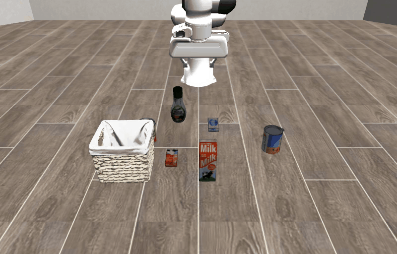
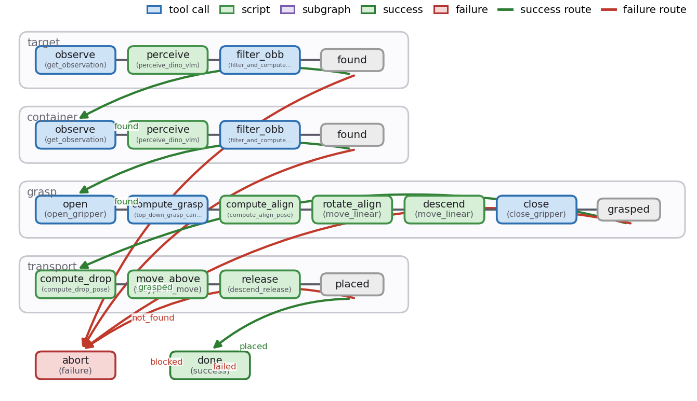
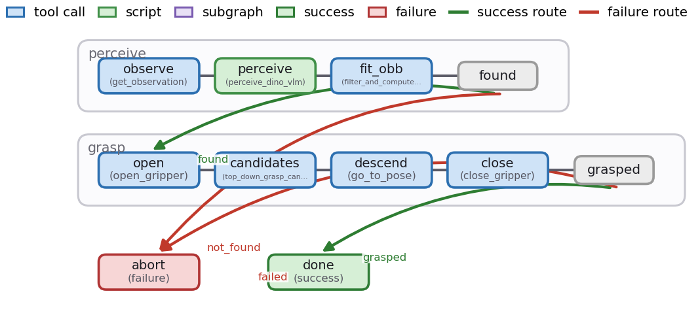

<div align="center">

# gap — graph as policy

**The policy is the graph.**
gap compiles a natural-language task into a typed, verified execution
graph of robot skills — and runs the graph, not a black-box policy, on
simulators and real robots.

[](LICENSE)
[](pyproject.toml)
[](https://github.com/graph-robots/open-robot-skills)

<table><tr>
  <td width="50%"></td>
  <td width="50%"></td>
</tr><tr>
  <td align="center"><sub>"pick up the soup can and put it in the basket" — live rollout</sub></td>
  <td align="center"><sub>the graph that ran it (rendered from <a href="examples/libero_quickstart/">examples/libero_quickstart</a>)</sub></td>
</tr></table>

</div>

```python
import gap

conn = gap.connector.sim("libero", task="libero_object/0")        # one process, no extra terminals
result = gap.execute("examples/libero_quickstart/graph", conn)    # skills auto-discovered
graph = gap.agent.generate_sync("pick up the soup can and put it in the basket")
print(graph)                                                      # the policy, as a graph
gap.viz.serve("outputs")                                          # browse the trial trace
```

Skills live in the sibling **[open-robot-skills](https://github.com/graph-robots/open-robot-skills)** repo (Anthropic
Agent Skills format, contributable) and are discovered by path — clone the
two repos side by side and every command finds them, no flags needed.
Everything runs **in one process**: env, vision models, IK. No gRPC, no
protobufs, no self-hosted model servers.

## Why gap

- 🧭 **Language → typed graph.** A coordinator → subgraph-agents → checkpoint-agent
  pipeline compiles one instruction into a validated workflow of skills,
  with a script-fix loop on validation errors.
- ✅ **Verified, not hoped.** LLM-authored postcondition checkpoints are
  enforced against simulator ground truth at every subgraph exit
  (`--checkpoints warn|raise`).
- 🧩 **Skills are contributable.** Strategies and model tools live in
  [open-robot-skills](https://github.com/graph-robots/open-robot-skills) as Agent Skills bundles — one directory, one
  PR. The LLM composes them; you can too.
- ⚡ **One process, no servers.** Env + vision models + IK in-process; plain
  numpy + TypedDicts as the data contract. Ray is an opt-in extra, never a
  prerequisite.
- 🔍 **The trace is the product.** Every run records `workflow.json`,
  `dag_trace.json`, per-node I/O and assets; `gap viz` browses them,
  `gap trace-diff` compares them.
- 📊 **Benchmarked with a gate.** A grid harness (modes × families × seeds)
  with `--gate`: the grocery-fulfillment acceptance config must clear
  **≥90% success** for a release.

## Measured results

Every number below was measured on this repo at the committed `uv.lock`;
per-seed tables and conditions are in the linked READMEs. No figures are
carried over from anywhere else.

- **Quickstart** — [libero_quickstart](examples/libero_quickstart/): **9/10 grasp**,
  7/10 end-to-end over 10 seeded LIBERO trials; ~25–55 s per trial on one A100.
- **Acceptance benchmark** — [grocery_fulfillment](examples/grocery_fulfillment/):
  **10/10** on the 10-task development gate (2026-06-11), graphs LLM-generated
  per task, nothing hand-written.
- **Release gate** — [benchmark](examples/benchmark/): `gap benchmark … --gate`
  must clear **≥90% success** over 10 tasks × 50 trials before any release.

## Get started

Requirements: **Linux + NVIDIA GPU (≥ ~10 GB VRAM) + EGL** (headless GPU
rendering — the `MUJOCO_GL=egl` in the commands below), an LLM API key
(Anthropic / OpenAI-compatible / Vertex), and [uv](https://docs.astral.sh/uv/).
First run downloads ~3.5 GB of model weights; `HF_TOKEN` (a free
[HuggingFace token](https://huggingface.co/settings/tokens)) is needed only
for the gated SAM3 weights. **No GPU?** Skip to
[gap in 2 minutes](#no-gpu-gap-in-2-minutes) — the engine runs anywhere.

```bash
git clone --recurse-submodules https://github.com/graph-robots/graph-as-policy.git
git clone https://github.com/graph-robots/open-robot-skills.git
```

The two repos must sit next to each other — skills are discovered by path:

```
your-workspace/
├── graph-as-policy/       # this repo (engine)
└── open-robot-skills/     # skill bundles — auto-discovered, no flags
```

```bash
cd graph-as-policy
uv sync --extra quickstart            # one venv: engine + LIBERO sim + perception models
uv run gap skills check --download    # install verification: per-bundle PASS/WARN/FAIL + weight prefetch
```

`gap skills check` is your install gate — it prints per-bundle
PASS/WARN/FAIL with an install hint for anything missing.

### 1. Run the quickstart graph

LIBERO sim + Grounding DINO + SAM3 + a hosted VLM + in-process IK,
executing a perceive → grasp → transport graph:

```bash
export ANTHROPIC_API_KEY=...          # or another provider, see "LLM providers"

MUJOCO_GL=egl uv run gap run examples/libero_quickstart/graph \
  --sim libero_object_all_variance/0
uv run gap viz                        # browse the recorded trial at localhost:9432
```

That one command, in one process:

- launched LIBERO (MuJoCo + EGL) on the seeded task variation;
- found the can and the basket with Grounding DINO + SAM3, disambiguated by a hosted VLM;
- fused masks + depth into oriented bounding boxes (OBBs) and derived a top-down grasp;
- executed perceive → grasp → transport with in-process IK;
- verified `target_held` against simulator ground truth at the subgraph exit;
- recorded the full trace to `outputs/` — that is what `gap viz` is browsing.

### 2. Generate a graph from language

```bash
uv run gap generate "pick up the alphabet soup can and place it in the basket"
```

The compiled policy prints right in the terminal (the same rendering
`print(graph)` gives you in Python) — here on the checked-in
[sample generated graph](examples/grocery_fulfillment/sample_generated_graph):

```text
task_00
Pick the blue and yellow alphabet soup can and place it in the basket.

START
  │
  ▼
┌─ target_sg ───────────────────────────────────────── perceiving-objects ─┐
│ observe ─▶ perceive ─▶ filter_obb                                        │
└──────────────────────────────────────────────────────────────────────────┘
  │ found                                                    abort ▶ ✗ abort
  ▼
┌─ container_sg ────────────────────────────────────── perceiving-objects ─┐
│ observe ─▶ perceive ─▶ filter_obb                                        │
└──────────────────────────────────────────────────────────────────────────┘
  │ found                                                    abort ▶ ✗ abort
  ▼
┌─ grasp_sg ─────────────────────────────────────── grasping-with-planner ─┐
│ open ─▶ compute_grasp ─▶ approach ─▶ observe ─▶ build_world ─▶ plan      │
│   ─▶ execute ─▶ close                                                    │
└──────────────────────────────────────────────────────────────────────────┘
  │ grasped                                                  abort ▶ ✗ abort
  ▼
┌─ transport_sg ──────────────────────────────────── transporting-objects ─┐
│ compute_drop ─▶ move_above ─▶ release                                    │
└──────────────────────────────────────────────────────────────────────────┘
  │ placed ▶ ✓ done                                          abort ▶ ✗ abort

✓ done (success)   ✗ abort (failure, recovery: open_gripper, go_home)
```

The [15-minute tour](docs/quickstart.md) walks both steps with the trace
open. (`uv run` needs no venv activation; `source .venv/bin/activate` once
if you prefer plain `gap …`. pip also works — see
[Installation details](#installation-details).)

### Pick your environment

One `uv sync` per setup; everything is declared in `pyproject.toml` and
pinned by the committed `uv.lock` (the measured-release environment).

| Command | What you get |
|---|---|
| `uv sync` | engine only — tests, validation, graph authoring (CPU, any OS) |
| `uv sync --extra quickstart` | + LIBERO sim + SAM3 / Grounding DINO / geometry bundles |
| `CUDA_HOME=/usr/local/cuda uv sync --extra grocery` | + CuRobo motion planning (CUDA build) — the acceptance-benchmark set |
| `CUDA_HOME=/usr/local/cuda uv sync --extra all` | + policy serving, Gemini-ER, Vertex provider, Ray workers |

Per-bundle dependencies and setup are declared bundle-by-bundle in
[open-robot-skills/pyproject.toml](https://github.com/graph-robots/open-robot-skills/blob/main/pyproject.toml) (one extra per
bundle); the extras above are the curated sets spanning both repos.

## No GPU? gap in 2 minutes

The engine runs anywhere. Build, validate, and render a real workflow
graph on a laptop — CPU-only, no API key, no simulator. It needs only the
[two clones above](#get-started), side by side with `--recurse-submodules`:

```bash
uv sync                                        # engine only, any OS
uv run python examples/hello_graph/hello.py    # → outputs/hello_graph/graph.png
```

<p align="center"></p>

In those two commands, gap:

- assembled a perceive-then-grasp workflow with `gap.builder` — the same
  artifact (`workflow.json` + `scripts/`) the LLM pipeline emits;
- ran it through the structural + skill-registry validation that gates
  every generated graph;
- rendered the typed graph to a PNG.

When you get to a GPU, the [quickstart graph](#get-started) is this same
kind of artifact, executing for real.

## Examples

All ten examples, from a CPU-only hello-world to the release gate and real
robots — the full gallery with time estimates and measured results is
[examples/README.md](examples/README.md).

| Example | What it shows | Needs |
|---|---|---|
| **Start here** | | |
| [hello_graph](examples/hello_graph/) | Build → validate → render your first graph — CPU only, no API key | `uv sync` (any OS) |
| [libero_quickstart](examples/libero_quickstart/) | The end-to-end hero: real vision → OBB grasp → transport, ground-truth verified — **9/10 grasp · 7/10 task** | `quickstart` + GPU + LLM key |
| **Author & generate graphs** | | |
| [build_a_graph](examples/build_a_graph/) | The full authoring example: checkpoints, recovery, `--execute` | `uv sync` (CPU to build) |
| [generate_a_graph](examples/generate_a_graph/) | Instruction → validated workflow dir; CLI + Python, all providers | `uv sync` + LLM key |
| [agent_quickstart](examples/agent_quickstart/) | Claude Code + one skill: sentence → generated graph → validated → sim success on video, step by step | `quickstart` + LLM key + Claude Code |
| **Benchmarks & evaluation** | | |
| [grocery_fulfillment](examples/grocery_fulfillment/) | The flagship acceptance family; graphs LLM-generated per task — **10/10 dev gate** | `grocery` + LLM key |
| [benchmark](examples/benchmark/) | Grid configs: smoke → position-variance (posvar) grid → the **≥90%** release gate | `grocery` + LLM key |
| **Learned policies** | | |
| [steered_policy](examples/steered_policy/) | Perceive + hover, then hand control to a learned VLA (vision-language-action) policy | `quickstart` + `policy` + LLM key |
| [collect_and_train](examples/collect_and_train/) | Graph as scripted expert → dataset → train → policy node | `quickstart` + `policy` + LLM key |
| **Real robots** — read [docs/safety.md](docs/safety.md) first | | |
| [cable_ur](examples/cable_ur/) | Perception-only UR + ZED connector (motion structurally impossible) | `real` + ZED SDK + UR arm |
| [real_franka_pick_place](examples/real_franka_pick_place/) | Franka + Robotiq pick-place loop via robots_realtime | `real` + hardware |

## CLI

| Command | Purpose |
|---|---|
| `gap run <graph> [--sim SUITE/TASK \| --real {franka,ur_zed}] [--validate-only]` | Execute (or just validate) a graph; tracing on by default → `outputs/` |
| `gap generate "<instruction>" [--provider P] [--model M] [--out DIR]` | LLM pipeline: instruction → validated workflow dir |
| `gap check [--format json] [--strict]` | Capability report: which tool bundles can run *here* (deps, GPU, keys, weights) and which skills are therefore runnable, with fix hints |
| `gap registry init \| list \| add <name> <path> \| remove <name>` | Manage skill registries (local bundle checkouts, layered by precedence) |
| `gap tools list [--tag T] \| show <name>` | The flat tool catalog with live input/output schemas |
| `gap skills list \| check [--download] \| table \| new <name> --kind {tool,skill} \| test [bundle…]` | Bundle catalog, validation, weight prefetch, scaffolding (with unit-test skeletons), per-bundle test runs |
| `gap benchmark <config.yaml> [--gate] [--resume]` | Benchmark grids; `--gate` exits non-zero below threshold |
| `gap viz [--root outputs] [--port 9432]` | Trial browser: graph swimlanes, per-node I/O, assets, videos |
| `gap policy serve <preset>` | One-command policy serving (`pi05-libero`, `molmoact-libero`) |
| `gap trace-diff <trial_a> <trial_b>` | Structural diff of two recorded traces |

`gap run`, `gap generate`, and `gap skills` accept `--skills PATH`
(repeatable), but none needs it: registries resolve automatically — see
the next section.

## Skill registries

Bundles live in **registries** — local directories with `tools/` and/or
`skills/` bundle roots.
[open-robot-skills](https://github.com/graph-robots/open-robot-skills) is
the canonical public registry; gap treats it as exactly that, an example.
Any number of registries are active at once, merged by precedence
(first wins; a lab registry can shadow a single public bundle instead of
forking the whole repo):

1. `--skills PATH` flags (repeatable — full override)
2. `$GAP_SKILLS_PATH` — now an OS-pathsep-separated **list**; a single
   path behaves exactly as before
3. the nearest `pyproject.toml` with `[tool.gap].registries = ["./skills", …]`
4. `~/.config/gap/registries.toml` (managed by `gap registry add/remove`)
5. an `open-robot-skills` checkout next to this one (auto-discovered)

```bash
gap registry init ~/my-lab-skills --add      # scaffold + activate a new registry
gap skills new wiping-tables --kind skill --registry my-lab-skills
gap skills test wiping-tables                # its scaffolded unit test
gap check                                    # what can run here, with fix hints
```

## Use with Claude Code & AI agents

gap ships an agent skill ([agent/](agent/)) that teaches AI coding
agents the workflows above:

```bash
claude plugin marketplace add graph-robots/graph-as-policy
claude plugin install gap@gap                  # the engine skill
claude plugin install open-robot-skills@gap    # optional: the robot bundle contracts
```

Then ask things like: *"what can this robot do right now?"* (registry +
capability checks), *"run the quickstart graph in sim"*, *"generate a
graph that packs the groceries"*, *"add a tested skill bundle that wipes
the table to my lab registry"*, or *"why did this trial fail?"* (trace
debugging). Real-robot commands stay gated on explicit human
confirmation. Other agents (Cursor, Codex, …) and the no-install path:
[agent/INSTALL.md](agent/INSTALL.md).

Step-by-step walkthrough (from a one-sentence prompt to a verified sim
success on video, with every command and real outputs):
[examples/agent_quickstart](examples/agent_quickstart/). Note Claude Code
needs only this one skill — the robot bundles in open-robot-skills are
consumed by gap's *internal* codegen agent as files on disk, not
installed into Claude Code.

## Authoring graphs in Python

LLM generation is one producer of graphs, not the only one. `gap.builder`
emits the identical artifact (`workflow.json` + `scripts/` + `checkpoints/`)
through the same validation — [examples/hello_graph](examples/hello_graph/)
is the 2-minute version, [examples/build_a_graph](examples/build_a_graph/)
the complete one (~40 lines of builder calls produce the full
quickstart-style pick-and-place artifact); [docs/runtime.md](docs/runtime.md)
specifies the JSON schema and executor semantics.

## LLM providers

| Provider | Setup |
|---|---|
| `anthropic` (default) | `export ANTHROPIC_API_KEY=...` |
| `openai` (incl. OpenRouter / vLLM) | `export OPENAI_API_KEY=...`; custom endpoints via config YAML |
| `vertex` | `gcloud auth application-default login` + `export GOOGLE_CLOUD_PROJECT=...`; pick it per call (`--provider vertex --model <m>`) or once per shell (`export GAP_LLM_PROVIDER=vertex GAP_LLM_MODEL=<m>`); run with the SDK: `uv run --extra vertex gap generate ...`; claude-* and gemini-* both route |

`--provider/--model` per call, or pin everything in a config YAML. The same
provider layer drives the `vlm` perception bundle (`GAP_VLM_PROVIDER`, …) —
see [examples/libero_quickstart](examples/libero_quickstart/README.md#vlm-provider).

## Architecture

```
┌────────────────────────── gap (engine) ──────────────────────────┐
│ agent/      instruction ─► coordinator ─► subgraph agents        │
│             ─► checkpoint agent ─► validate / fix ─► graph       │
│ runtime/    executor (super-steps, streaming, Send), validator,  │
│             tracing, policy loop, verify/ (World, checkpoints)   │
│ tools/      ToolRegistry: typed schemas, tags→guards, dispatch   │
│ connector/  sim()/real(), env registry, in-process pyroki IK,    │
│             rr_launcher, data collector                          │
│ envs/       libero (+perturbed), franka_real, ur_zed, msgpack    │
│ benchmark/  grid harness (modes × families × seeds), --gate      │
│ viz/        FastAPI+React trial browser, replay3d, PDF render    │
└──────────────┬───────────────────────────────▲───────────────────┘
               │ discovers (by path)           │ registers tools
        ┌──────▼───────────────────────────────┴──────┐
        │ open-robot-skills (Agent Skills format, contributable)
        │ tools/   sam3, grounding-dino, gemini-er,    │
        │          molmo, vlm, curobo, geometry        │
        │ skills/  perceiving-objects(-oneshot/        │
        │          -multiview), perceiving-object-     │
        │          parts, grasping-*, transporting-    │
        │          objects, tracking-objects,          │
        │          pi05-libero, molmoact-libero        │
        └──────────────────────────────────────────────┘
```

- **Tools vs skills.** Tools are *what the robot can compute* (model-named
  bundles exposing typed functions); skills are *what the robot can do*
  (strategies that own subgraphs). Connector tools (`robot.*`/`sim.*`) are
  the embodiment surface, shipped by the engine.

## Installation details

- **uv (recommended).** The commands above. `uv sync` reads the committed
  `uv.lock` — the exact environment the acceptance benchmark was measured
  on — and resolves the vendored sim submodules and the sibling open-robot-skills
  checkout automatically (`[tool.uv.sources]`).
- **Forgot `--recurse-submodules`?** `git submodule update --init` fixes
  `uv sync`'s "does not appear to be a Python project" error — the lockfile
  references the vendored submodules even for engine-only installs. The two
  repos cloned side by side are always required for the same reason.
- **pip.** Works, with the submodules and sibling named explicitly (from
  the parent directory of the two checkouts):

  ```bash
  pip install -e "graph-as-policy[libero]" \
    -e graph-as-policy/third_party/Variational-Automation-Benchmark \
    -e graph-as-policy/third_party/robosuite \
    -e "open-robot-skills[quickstart]"
  gap skills check --download
  ```

  Note: sam3's metadata over-pins `numpy==1.26`; uv applies the documented
  override, plain pip may need `pip install "numpy>=2" --force-reinstall`
  afterwards.
- **CuRobo** (`--extra grocery` / `--extra all` / `open-robot-skills[curobo]`)
  compiles CUDA extensions at install time: set `CUDA_HOME` to a toolkit
  matching torch's CUDA (pip users add `--no-build-isolation`).
- **Weights.** pip/uv own all code installs; `gap skills check` only
  verifies, and `--download` prefetches model weights — nothing installs
  behind your back.

## Roadmap

v1 draws the line at language → verified pick-and-place graphs on LIBERO +
real Franka/UR. Cut for scope, returning after v1: execution-feedback graph
repair, learned grasp planners (graspgen/m2t2), a remote model-serving tier,
bimanual support, Isaac-based rehearsal, non-pick-place domains
(articulated, contact-rich, long-horizon), self-hosted pointing VLMs.

## Learn more

- **Tutorial:** [the 15-minute tour](docs/quickstart.md) — hello_graph → quickstart → generate, with the trace open
- **Reference:** [runtime & schema](docs/runtime.md) · [skill authoring](docs/skills.md) · [safety](docs/safety.md) · [design doc](docs/design.md)
- **Contribute:** engine PRs via [CONTRIBUTING.md](CONTRIBUTING.md); skills are one directory + one PR in [open-robot-skills](https://github.com/graph-robots/open-robot-skills)

## License & attribution

gap and open-robot-skills are MIT-licensed. They stand on third-party work —
LIBERO/LIBERO-PRO, the Variational-Automation-Benchmark fork, robosuite,
robots_realtime, pyroki, SAM3, Grounding DINO, and (optionally) NVIDIA
cuRobo — each under its own license. See **[NOTICE.md](NOTICE.md)** for the
full attribution table.
