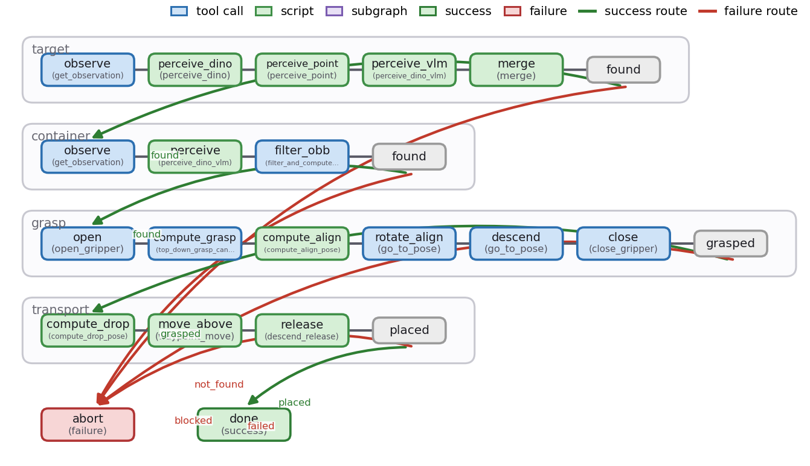

# Quickstart: The 15-Minute Tour

Zero to a verified rollout, with the trace open. You will:

- run the checked-in quickstart graph on the LIBERO simulator — vision
  models, IK, and the sim in one process;
- read the recorded trace, the artifact everything else revolves around;
- browse it in `gap viz`;
- generate your own graph from one sentence.

::::{grid} 1 1 2 2
:gutter: 3

:::{grid-item}


*"pick up the soup can and put it in the basket" — live rollout*
:::

:::{grid-item}


*the graph that ran it*
:::
::::

:::{note} Requirements
Linux + an NVIDIA GPU (≥ ~10 GB VRAM) with EGL, the
[two repos installed](installation.md) with
`uv sync && uv run gap skills install --all`, and an LLM API key
(`export OPENROUTER_API_KEY=...`, or
[another provider](../authoring/llm-providers.md)). The first run
downloads ~3.5 GB of model weights; set `HF_TOKEN` for the gated SAM3
weights — see [Model weights](installation.md#model-weights).
:::

## Minute 0–6: run the quickstart graph

LIBERO sim + Grounding DINO + SAM3 + a hosted VLM + in-process IK,
executing a perceive → grasp → transport graph:

```bash
export OPENROUTER_API_KEY=...          # or another provider

MUJOCO_GL=egl uv run gap run examples/libero_quickstart/graph \
  --sim libero_object_all_variance/0
```

`MUJOCO_GL=egl` selects headless GPU rendering and is required on every
sim command; `--sim SUITE/TASK` picks the seeded LIBERO task variation.

While it runs (~25–55 s per trial, measured on an A100), what you are
watching in the log: perception (Grounding DINO proposes boxes, a hosted
VLM picks the right one, SAM3 segments it), geometry (mask + depth →
oriented bounding box → top-down grasp candidates), then motion (align,
descend, close, transport). That one command, in one process:

- launched LIBERO (MuJoCo + EGL) on the seeded task variation;
- found the can and the basket with Grounding DINO + SAM3, disambiguated
  by a hosted VLM;
- fused masks + depth into oriented bounding boxes and derived a top-down
  grasp;
- executed perceive → grasp → transport with in-process IK;
- verified `target_held` against simulator ground truth at the subgraph
  exit;
- recorded the full trace to `outputs/`.

Two flags worth knowing now: `--validate-only` checks a graph (structure
plus skill registry) without touching a sim, and
`--checkpoints off|warn|raise` (default `warn`) controls how ground-truth
postcondition checkpoints are enforced at subgraph exits — see
[Checkpoints](../running/checkpoints.md).

## Reading the trace

When it finishes, the **trace** is in `outputs/run_<timestamp>/`:

```text
outputs/run_<timestamp>/
├── workflow.json        # the graph that ran (self-contained copy)
├── dag_trace.json       # every node visit: timings, exits, errors, routing
├── node_data/<node>/    # per-node inputs/outputs + extracted assets
└── scripts/             # the script nodes, as executed
```

`node_data/` is where debugging lives: the perception node's directory
holds the camera frames it saw (PNG), the masks and point clouds it
produced (NPZ), and the VLM exchange; the grasp nodes record the poses
they targeted. If a run fails, the failing node's directory shows exactly
what it was looking at when it failed. The full layout is specified in
[Traces](../running/traces.md) — it is a stability guarantee, safe to
build tooling against.

A rollout video is recorded automatically for sim runs: the run is
saved as `<trace-dir>/run_video.mp4` alongside the JSON for easy sharing
(plus per-camera videos when the env buffers them). Open it from disk with
any player. Pass `--no-video` if you want to skip rendering.

## Minute 6–8: browse it

```bash
uv run gap viz                        # browse the recorded trial at localhost:9432
```

Click into the trial: the graph renders as swimlanes (one per subgraph)
with the executed route highlighted; clicking a node shows its inputs,
outputs, timings, and assets — the same `node_data/` you just saw, with
images inline. When two runs disagree,
`gap trace-diff <trial_a> <trial_b>` diffs them structurally.

## Minute 8–15: generate your own

```bash
uv run gap generate "pick up the alphabet soup can and place it in the basket"
```

The agent pipeline — coordinator → per-subgraph agents → checkpoint
agent — picks skills from the open-robot-skills catalog, writes the
subgraphs and their scripts, attaches ground-truth checkpoints, and
validates the result; on validation errors a script-fix loop repairs its
own output (you'll see those attempts in the log). The compiled policy
prints in the terminal as a box-drawing graph, and the artifact lands in
`outputs/generated_<timestamp>/task_00/` — the same shape as the
quickstart graph's, so you already know how to read it. Run it:

```bash
MUJOCO_GL=egl uv run gap run outputs/generated_<timestamp>/task_00 \
  --sim libero_object_all_variance/0
```

:::{note}
`gap run` must target the `task_00/` subdirectory, not the `--out`
directory itself — generation writes one folder per task.
:::

[Generation](../authoring/generation.md) covers the pipeline, providers,
and config in depth.

## Where next

| You want to | Go to |
|---|---|
| See everything GaP can do | [Examples gallery](../examples/index.md) |
| Understand the vocabulary precisely | [Concepts](concepts.md) |
| Author graphs in Python | [Build a graph](../examples/build-a-graph.md) · [The builder API](../authoring/builder.md) |
| Write or contribute a skill | [Authoring bundles](../skills/authoring-bundles.md) |
| Make a success-rate claim | [Benchmarking](../benchmarks/benchmarking.md) — one green run is not a number |
| Move a real robot | [Safety](../real-robots/safety.md) **first**, then [Franka pick & place](../examples/real-franka-pick-place.md) |
